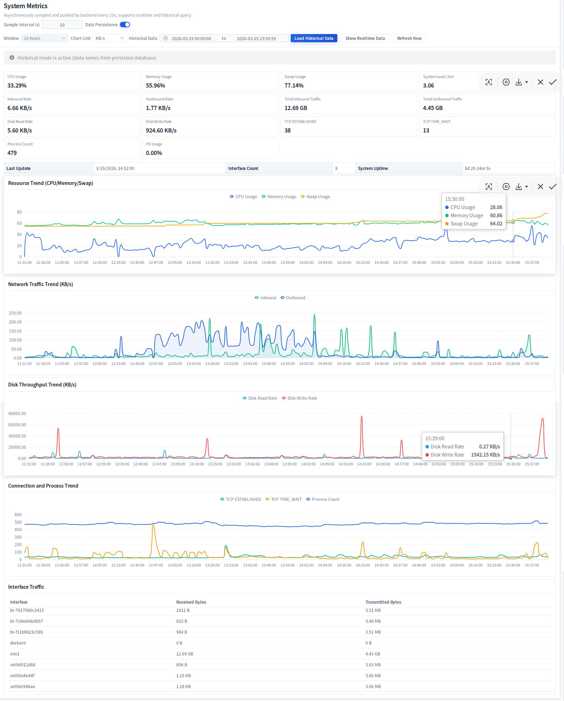

# SSLProxyManager

**[English Documentation](README.md)**

[](https://opensource.org/licenses/MIT)
[](https://www.rust-lang.org)
[](https://tauri.app/)
[](#)

强大的桌面代理管理应用，基于 **Tauri 2 + Rust** 构建，前端采用 **Vue 3**。支持 HTTP/HTTPS、WebSocket 和 Stream 代理，提供全面的访问控制、限流、可观测性和测试工具——一切尽在统一界面。

## 核心亮点

- **多协议支持**：HTTP/HTTPS 反向代理、WebSocket (WS/WSS)、Stream (TCP/UDP 四层代理)
- **精细化访问控制**：HTTP/WS/Stream 独立开关，支持局域网放行、白名单、黑名单
- **完善的可观测性**：实时仪表板、历史指标、请求日志（SQLite）、系统监控
- **内置测试工具**：HTTP 测试、路由匹配、性能测试、DNS 查询、SSL 证书检查、端口扫描、编解码工具等
- **性能优化**：LRU 缓存、连接池、零拷贝架构、Rustls 安全 TLS

## 程序界面

<details>
<summary>点击展开截图</summary>




</details>

## 核心功能

### HTTP/HTTPS 代理（`rules` / `routes`）

- 多监听地址支持（`listen_addr` / `listen_addrs`）
- TLS 证书（Rustls 安全实现）
- Basic Auth 认证，支持可选转发 `Authorization` 头
- 路由匹配：Path + 可选 Host/Method/Header 条件
- URL 重写、请求体/响应体替换
- 静态目录优先 + SPA 回退支持
- 上游加权负载均衡（平滑加权轮询）
- 路由级跟随重定向

### WebSocket 代理（`ws_proxy`）

- 全局开关 + 规则级开关
- WS/WSS 协议支持
- 最长前缀路径匹配

### Stream 代理（`stream`）

- TCP 和 UDP 转发
- 上游健康检查与故障转移
- 基于 `$remote_addr` 的哈希选择，支持一致性哈希

### 访问控制

- HTTP / WS / Stream 独立开关
- 局域网放行、白名单、黑名单模式

### 可观测性

- 实时仪表板指标
- SQLite 历史指标与请求日志
- 系统指标监控（Linux/Windows）：CPU、内存、Swap、网络、磁盘吞吐、TCP 状态、进程/文件句柄数、运行时长
- 实时日志面板

### 内置测试工具

- HTTP 请求测试
- 路由匹配测试 + 测试套件
- 性能测试
- 配置校验
- DNS 查询
- SSL 证书信息检查
- 自签证书生成
- 端口扫描
- 编解码工具

### 性能特性

- LRU 缓存加速上游响应
- 连接池管理，可配置空闲超时
- HTTP/2 支持
- Gzip 和 Brotli 压缩
- 零拷贝文件服务
- 高效缓冲池管理

## 技术栈

| 层级 | 技术 |
|------|------|
| 后端 | Rust、Tauri 2、Axum、Tokio、SQLx（SQLite） |
| 前端 | Vue 3、Vite、Element Plus、ECharts、Vue I18n |
| TLS | Rustls（内存安全 TLS） |
| 平台 | Windows、Linux、macOS |

## 快速开始

### 环境要求

- Node.js + npm
- Rust stable 工具链

### 安装运行

```bash
# 安装前端依赖
cd frontend && npm install && cd ..

# 开发模式
npm run tauri:dev

# 构建发布包
npm run tauri:build
```

## 项目结构

```
SSLProxyManager/
├── src/                    # Rust 后端
│   ├── proxy.rs           # HTTP/HTTPS 代理核心
│   ├── ws_proxy.rs        # WebSocket 代理
│   ├── stream_proxy.rs    # Stream (TCP/UDP) 代理
│   ├── access_control.rs  # 访问控制
│   ├── config.rs          # 配置管理
│   └── ...
├── frontend/              # Vue 3 前端
│   ├── src/
│   │   ├── components/    # Vue 组件
│   │   ├── i18n/         # 国际化
│   │   └── ...
│   └── ...
├── config.toml.example    # 配置模板
└── tauri.conf.json       # Tauri 配置
```

## 配置说明

### 配置文件位置

运行时配置使用 TOML 格式。

| 平台 | 位置 |
|------|------|
| Debug 模式 | 项目根目录 `./config.toml`（若存在） |
| Linux | `$XDG_CONFIG_HOME/SSLProxyManager/config.toml` 或 `~/.config/SSLProxyManager/config.toml` |
| Windows | 可执行文件同目录 `config.toml`，或 `%APPDATA%\SSLProxyManager\config.toml` |
| macOS | `~/Library/Application Support/SSLProxyManager/config.toml` |

### 快速配置参考

建议以 `config.toml.example` 为模板。

#### HTTP/HTTPS（`[[rules]]`）

```toml
listen_addrs = ["0.0.0.0:8080"]
ssl_enable = true
cert_file = "/path/to/cert.pem"
key_file = "/path/to/key.pem"
basic_auth_enable = true
basic_auth_username = "admin"
basic_auth_password = "secret"

[[rules.routes]]
path = "/api"
host = "example.com"  # 可选
methods = ["GET", "POST"]  # 可选
upstream_url = "http://localhost:3000"
weight = 1
```

#### WebSocket（`[[ws_proxy]]`）

```toml
ws_proxy_enabled = true

[[ws_proxy.rules]]
enabled = true
listen_addr = "0.0.0.0:8081"
ssl_enable = false

[[ws_proxy.rules.routes]]
path = "/ws"
upstream_url = "ws://localhost:8082"
```

#### Stream（`[stream]`）

```toml
[stream]
enabled = true

[[stream.upstreams]]
name = "backend"
hash_key = "$remote_addr"
consistent = true

[[stream.upstreams.servers]]
addr = "10.0.0.1:80"
weight = 1
max_fails = 3
fail_timeout = "30s"

[[stream.servers]]
enabled = true
listen_port = 9000
proxy_pass = "backend"
```

#### 系统指标

```toml
system_metrics_sample_interval_secs = 10  # 1-300 秒
system_metrics_persistence_enabled = true
```

#### 指标存储

```toml
[metrics_storage]
enabled = true
db_path = "./data/metrics.db"
```

## CI: 手动构建

工作流：`.github/workflows/manual-build-single-platform.yml`

### 触发方式

GitHub Actions → `Manual Build (Single Platform)` → `Run workflow`

### 输入参数

| 参数 | 选项 | 说明 |
|------|------|------|
| `platform` | `windows-x64`, `linux-amd64`, `macos-arm64`, `macos-x64` | 目标平台 |
| `publish_release` | `true`, `false` | 是否发布到 GitHub Release |
| `release_tag` | （可选） | 覆盖版本标签 |

## 常见问题

**Q: 开发模式前端端口是多少？**  
A: `5173`（见 `tauri.conf.json -> build.devUrl`）

**Q: 如何自定义前端 dev/build 命令？**  
A: 修改 `tauri.conf.json` 的 `build.beforeDevCommand` 与 `build.beforeBuildCommand`

**Q: 关闭窗口会退出程序吗？**  
A: 不会，默认隐藏到系统托盘。

**Q: 如何启用指标持久化？**  
A: 在配置中设置 `metrics_storage.enabled = true` 和 `metrics_storage.db_path`

**Q: 支持 HTTP/2 吗？**  
A: 支持，默认启用（`enable_http2 = true`）

## 免责声明

本项目仅用于**学习与合法合规的网络代理/反向代理配置管理**场景。

- **合法合规**：请确保你的使用行为符合当地法律法规。禁止用于未授权访问、攻击、数据窃取或任何非法用途。
- **无担保**：按"现状"提供，不提供任何担保。
- **责任限制**：对直接或间接损失不承担责任。

若不同意上述条款，请勿使用本项目。

## 许可证

MIT，详见 [LICENSE](LICENSE)。

## 仓库

- GitHub: <https://github.com/userfhy/SSLProxyManager-Tauri>
